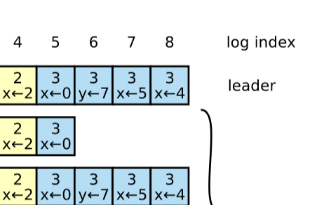
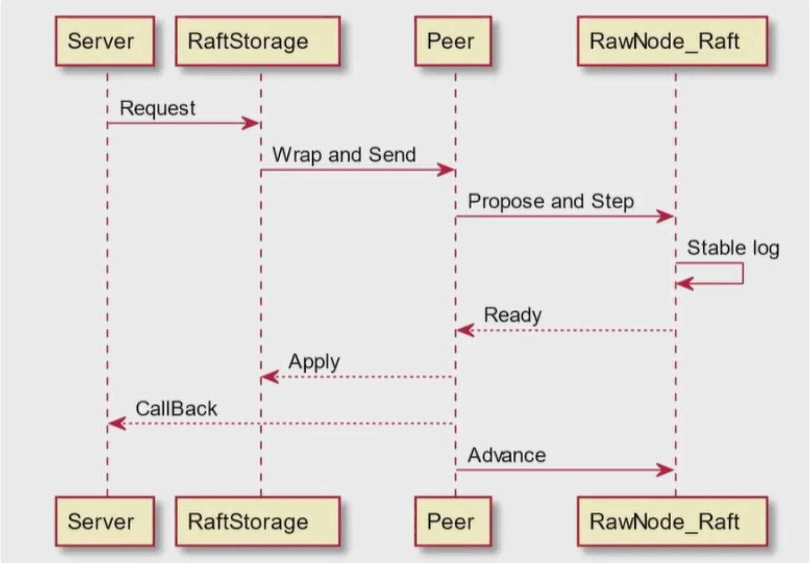

# Project1 StandaloneKV
    实现一个支持Column family的单机键值存储引擎,并使用request&response的形式对此进行封装

键值存储具备如下的通用接口: `Put`,`Get`,`Delete`,`Scan`,这些功能已经由`badger`库实现,TinyKV使用`badger`库提供基础KV支持  

`Project1`要求我们对`badger`库进行封装,使其支持`Column Family`(缩写为`CF`)功能,并对外提供接口;在TinyKV中,可以简单地将`CF`理解为键值的前缀,例如将键值对 `(PDSL,1)`存放到Table1中,那么我们需要将`PDSL`改写为`Table1_PDSL`,随后再写入数据库。TinyKV提供`engine_util`包来实现上述的`CF`功能

实现`StandaloneKV`的封装后,将对应的增删改查接口在`raw_api.go`中以请求响应的形式再封装一遍即可

# Project2 
    实现Raft算法,在此基础上实现可容错的KV并支持压缩日志和快照功能
## Project 2A
### Project 2AA & 2AB
    领导人选举和日志复制两个模块是紧密相连的,一定要一起实现后再测试

`TinyKV`的raft实现非常精妙,不同于Raft论文中提到的使用rpc通讯,TinyKV中的raft使用`msgs []pb.Message`通信,由外部模块进行事件驱动,因此实现raft模块时只需要关注什么时候**需要发送msg,msg的字段如何设置,接受到msg如何响应**。

raft模块通过Step接口对外提供事件处理功能,内部实现时需要拆分为LeaderStep,FollowerStep,CandidateStep三个函数,根据身份不同,需要处理的信息不同,同一信息的处理方式也不同

实现raft时只需要关注三个结构体,分别是`Raft`,`RaftLog`,`Storage`。
Raft的定义非常清晰,负责处理状态变化并调用RaftLog添加日志。
RaftLog和Storage则较为困惑
```golang
type RaftLog struct {
	// storage contains all stable entries since the last snapshot.
	storage Storage
	// committed is the highest log position that is known to be in
	// stable storage on a quorum of nodes.
	committed uint64
	// applied is the highest log position that the application has
	// been instructed to apply to its state machine.
	// Invariant: applied <= committed
	applied uint64
	// log entries with index <= stabled are persisted to storage.
	// It is used to record the logs that are not persisted by storage yet.
	// Everytime handling `Ready`, the unstabled logs will be included.
	stabled uint64
	// all entries that have not yet compact.
	entries []pb.Entry
	// the incoming unstable snapshot, if any.
	// (Used in 2C)
	pendingSnapshot *pb.Snapshot
	// Your Data Here (2A).
}
```

```golang
type Storage interface {
	// InitialState returns the saved HardState and ConfState information.
	InitialState() (pb.HardState, pb.ConfState, error)
	// Entries returns a slice of log entries in the range [lo,hi).
	// MaxSize limits the total size of the log entries returned, but
	// Entries returns at least one entry if any.
	Entries(lo, hi uint64) ([]pb.Entry, error)
	// Term returns the term of entry i, which must be in the range
	// [FirstIndex()-1, LastIndex()]. The term of the entry before
	// FirstIndex is retained for matching purposes even though the
	// rest of that entry may not be available.
	Term(i uint64) (uint64, error)
	// LastIndex returns the index of the last entry in the log.
	LastIndex() (uint64, error)
	// FirstIndex returns the index of the first log entry that is
	// possibly available via Entries (older entries have been incorporated
	// into the latest Snapshot; if storage only contains the dummy entry the
	// first log entry is not available).
	FirstIndex() (uint64, error)
	// Snapshot returns the most recent snapshot.
	// If snapshot is temporarily unavailable, it should return ErrSnapshotTemporarilyUnavailable,
	// so raft state machine could know that Storage needs some time to prepare
	// snapshot and call Snapshot later.
	Snapshot() (pb.Snapshot, error)
}
```
首先要明确RaftLog是一个存在于内存中的结构,这就决定了RaftLog不能存储太多的日志,因此需要定期将一部分日志写入到磁盘等介质中(对应代码注释中的稳定存储),这样的话,RaftLog中的日志在大部分时候是被截断的。因此,日志复制在进行日志匹配时,需要考虑storage中的日志。



在上图中,RaftLog只存有LogIndex从4开始的连续日志,LogIndex小于4的日志均被写入稳定存储,因此使用stable字段来标识哪些日志在raftLog中,哪些被写入Storage,在此例中raftLog.stabled = 3

commited字段严格对应Raft论文中的日志提交部分,只要一个Raft组中的大多数结点都复制了某条日志,那么整个Raft组就可以将committed设置为这条日志的Index。提交表明日志可以安全地被应用到状态机。

applied表明日志在此之前的日志已经被应用(Project 2B中实现该功能)

Storage接口最让人困惑的地方就在于,只提供了读接口,没有提供写接口,那么究竟在哪里写入呢？上面已经提到了,TinyKV的Raft模块由外部驱动,外部模块知道storage的具体类型,负责storage的写入。

### Project 2AC
    实现raft和外部模块之间的接口层RawNode

RawNode负责检测raft模块是否有新的提交或新的变化需要得到应用,以及将其应用到raft模块

```golang
func (rn *RawNode) HasReady() bool {}
func (rn *RawNode) Ready() Ready {}
func (rn *RawNode) Advance(rd Ready) {}
```

HasReady函数检测raft软状态,硬状态是否变化；是否有需要处理的msg,是否有未被应用的日志,是否有不稳定的日志  
Ready函数将上述的变化封装为一个结构体返回给上层模块做同步  
Advance将变化应用到raft模块,其实就是设置raftlog的stabled,applied字段并清空msgs  

## Project 2B
    使用Raft实现具备容错能力的键值存储服务

TinyKV总体设计


TinyKV基本概念


* Store表示一个TinyKV-Server实例,对外提供KV服务
* Peer表示Store内部的一个Raft结点,一个Store可以有多个Peer,也就是可以有多个不同的Raft
* Region表示Raft组,是一组raft,对应不同Store上的多个Peer;

在Project 2B中只需要考虑单Raft Group的情况,在此基础上实现PeerStorage的功能

由总体设计图可以看出,PeerStorage是一个中间的抽象层,它将RaftStorage发送的Request请求作为日志添加到Raft模块,等到Raft模块完成一致性同步后(commit),将请求应用到状态机(apply),并向上层返回RequestResponse和CallBack,最后将更改应用到Raft模块

PeerStorage实现了Project 2A中提到的Storage接口,负责日志信息和元信息的持久化写入

PeerStorage内部维持了两个badger实例: raftdb和kvdb
raftdb存储raft log和RaftLocalState;kvdb存储RegionLocalState和RaftApplyState,对应Raft Paper中的状态机
* RaftLocalState: 存储Raft.HardState和Last Log Index
* RaftApplyState: 存储Raft Apply的最后一条日志索引以及RaftLogGC引起的日志截断相关信息
* RegionLocalState: 存储Region信息以及在Store上的属于Region的Peer的状态

PeerStorage像下述伪代码一样使用Raft:
```golang
for {
  select {
  case <-s.Ticker:
    Node.Tick()
  default:
    if Node.HasReady() {
      rd := Node.Ready()
      saveToStorage(rd.State, rd.Entries, rd.Snapshot)
      send(rd.Messages)
      for _, entry := range rd.CommittedEntries {
        process(entry)
      }
      s.Node.Advance(rd)
    }
}
}
```

## Project 2C
    实现日志压缩和快照

显然,对于一个长时间运行的Raft集群,内存中能够保留的日志数量是有限的,因此当内存中的日志数量超过上限后会触发日志压缩事件;压缩日志后,落后的结点需要从压缩后的状态开始同步(新启动的结点,离线重连的结点等),因此引入快照功能。

RaftLogGc改变了PeerStorage.ApplyState.TruncatedIndex;也改变了Raft.RaftLog.Storage.FirstIndex();因此Leader在发送AppendEntries命令时会发现日志出现截断

```golang
func (ps *PeerStorage) FirstIndex() (uint64, error) {
	return ps.truncatedIndex() + 1, nil
}
```

在日志截断时,发送快照;
快照接受方使用快照更新RaftLog的stabled,commit,apply字段并在需要时添加一个Entry{snap.Index,snap.Term}来保持日志的连续性

在应用快照时,需要根据快照信息更新Region信息,否则新加入Region的结点无法意识到其他结点的存在,导致事实上的分区

**快照引起的bug**:
1. ApplySnapShot时对应的文件不存在: Leader结点不需要应用快照,因此也不需要设置pendingSnapShot字段
2. 新加入的结点无法成为Leader,Request Timeout: 应用快照后没有更新Region信息


